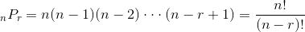

# abstract

- n개에서 r개를 순서없이 골라내는 방법과 같다.

```latex
\binom{n}{r} = \binom{n-1}{r-1} \binom{n-1}{r}
```


- 이항계수는 조합과 같다.

```latex
_{n}C_{r} = \frac{n!}{r!(n-r)!}
```




- n개에서 r개를 순서를 고려하여 골라내는 방법을 순열이라고 한다. 

```latex
_{n}P_{r} = \frac{n!}{(n-r)!}
```


