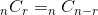

# abstract

- 이항계수에 대해 적는다. 먼저 순열과 조합을 이해해야 한다.

# permutation

- n개에서 r개를 중복하지 않고 순서를 고려하여 골라내는 방법을 순열이라고 한다. 
  nPr = n x (n-1) x (n-2) x ... x (n-r+1)이다. 따라서 다음과 같은 
  정리를 유도할 수 있다.

```latex
_{n}P_{r} = n (n-1) (n-2) \cdot\cdot\cdot (n-r+1) = \frac{n!}{(n-r)!}
```


# combination

- n개에서 r개를 순서없이 골라내는 방법과 같다. n개에서 r개를 선택하는 순열을
  r개의 순서를 고려한 경우의 수(r!)로 나눈 것과 같다.

```latex
_{n}C_{r} = \frac{_{n}P_{r}}{r!} = \frac{n!}{r!(n-r)!}
```


- n개에서 r개를 선택하는 것은 n개에서 n-r개를 선택하지 않는 것을
  선택하는 것과 가짓수가 같다.

```latex
_{n}C_{r} = _{n}C_{n-r}
```



- n개중 한개를 고정한다. 이제 n개중 r개를 선택하는 가짓수는 그 한개가 있는 경우와
  없는 경우 2가지로 나눠진다. 각각 n-1Cr-1, n-1Cr로 표현할 수 있다. 

```latex
_{n}C_{r} = _{n-1}C_{n-r} + _{n-1}C_{r}
```


# binomial coefficient

- 이항계수는 조합과 같다.

```latex
\binom{n}{r} = \binom{n-1}{r-1} \binom{n-1}{r}
```


